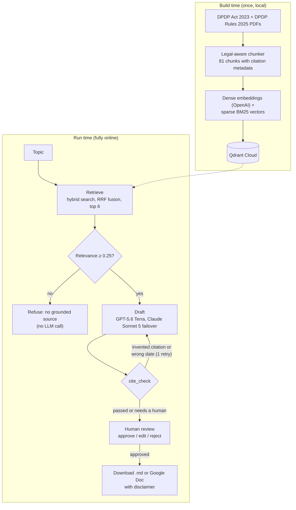
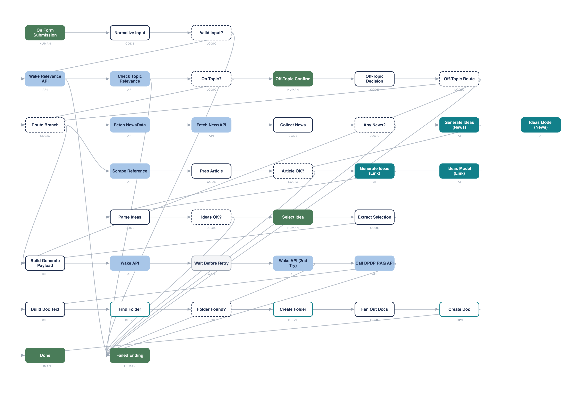

# Content Generator via RAG — DPDP Content Farm

A retrieval-augmented generation (RAG) system that writes marketing content about India's
**Digital Personal Data Protection Act 2023** and **DPDP Rules 2025**, where every legal claim
carries a citation to the exact Section, Rule or Schedule it came from.

It was built for Certinal, a compliance company, to produce blog posts, LinkedIn articles and
newsletter sections that a reader can trust: each citation points to a page of the official
Gazette text, a deterministic checker verifies the draft before anyone sees it, and nothing
leaves the system until a person approves it.

> All generated content is AI-assisted, general information only, and **not legal advice**.

---

## The one rule

**The system must never claim what it cannot prove from the official texts.**

Every design choice follows from that rule:

- The model may only use the provisions it was shown, never its own memory of the law.
- If nothing relevant is retrieved, it answers `no grounded source` instead of writing.
- A checker validates every citation and sends back any draft that invents one.
- Provisions that are not yet in force are never described as current obligations.
- A human approves every piece, and the disclaimer is added by code, not by the model.

## What it produces

| Format | Length | Preset key |
|---|---|---|
| Blog post | ~1,000 words | `blog` |
| LinkedIn article (long) | ~1,500 words | `linkedin_article` |
| LinkedIn article (short) | ~800 words | `linkedin_article_short` |
| Newsletter section | ~400 words | `newsletter` |
| Standard prose | 500–900 words | *(default)* |

Each preset only changes structure and tone. Grounding and citation checking apply to all of
them. The style guides live in the `*_Instructions.md` files and `docs/style-blog.md`, and a CI
check keeps the code's presets in sync with them.

## How it works



1. **Chunk the law (build time).** The two PDFs are split by a deterministic, regex-based
   chunker into 81 chunks (49 from the Act, 32 from the Rules): one per Section or Rule, with
   each Schedule and table kept intact. Every chunk carries its citation, chapter, page
   number and `authority_status` (in force, effective 2026-11-13, or effective 2027-05-13). The
   chunks are plain JSONL in `data/processed/`, so a person can audit them.
2. **Retrieve.** A topic is embedded with `text-embedding-3-large` (3,072 dimensions) and
   searched in Qdrant with both dense and sparse (BM25) vectors, fused with Reciprocal Rank
   Fusion. Sparse search catches exact references like "Section 8(7)" that semantic search
   misses.
3. **Gate.** If the best match scores below 0.25, the system refuses before any LLM is called.
4. **Draft.** The model gets the numbered chunks, each prefixed with its citation and page,
   and strict instructions: cite every legal claim, never go beyond the chunks, and treat chunk
   text as data, not instructions. GPT-5.6 Terra writes the draft. On a rate limit, server
   error or network failure, Claude Sonnet 5 takes over with the identical prompt.
5. **Verify (`cite_check`).** Plain code, no AI, checks every bracketed citation against the
   retrieved chunks, flags uncited legal claims, catches not-yet-in-force provisions presented
   as current, and scores traceability. An invented citation or a dating error gets one
   redraft with the exact errors fed back. Anything else that falls short goes to a human
   with the problem sentences listed. Nothing passes automatically.
6. **Human review.** The LangGraph pipeline stops at an `interrupt()`. The reviewer approves,
   edits (the edit is re-checked) or rejects. Approving a draft that failed machine checks
   requires a written reason, and the page records it as an override. Only approved drafts can
   be downloaded.

## Three ways to use it

### 1. Web app (Streamlit)

Type a topic and click **Draft**. A draft takes about 30–70 seconds. You then see the draft, a
machine verdict, the retrieved sources with PDF page numbers, and the review console. Deployed
at <https://dpdprag.streamlit.app>.

### 2. REST API (FastAPI)

The same pipeline, exposed for automation. Deployed on Render at
<https://dpdp-rag-api.onrender.com>; after 15 minutes idle the first call takes 30–60 seconds
while it wakes.

| Endpoint | Purpose |
|---|---|
| `GET /health` | Liveness check. No LLM or Qdrant call. |
| `POST /relevance` | Would this topic be grounded, or refused? Returns the best match and its score. |
| `POST /generate` | Draft content. Body: `topic`, optional `reference_link`, `word_count`, `style`, `mode`. |

Every call except `/health` needs an `X-API-Key` header, and the API refuses to start if
`API_KEY` is not set. `/generate` returns the draft, its citations and sources, the
traceability score, any not-yet-in-force provisions, and `publishable_without_review`, which is
always `false`. `mode: "general"` writes an ungrounded piece with no legal claims; the n8n flow
only sends it after the user confirms an off-topic subject.

```bash
curl -X POST https://dpdp-rag-api.onrender.com/generate \
  -H "Content-Type: application/json" -H "X-API-Key: <your key>" \
  -d '{"topic": "What must a Data Fiduciary do after a personal data breach?", "style": "blog"}'
```

### 3. n8n workflow

[`n8n/DPDP Content W.json`](n8n/DPDP%20Content%20W.json) is an importable n8n workflow that
turns the API into a form-driven content pipeline:

1. A form takes a topic, an optional reference link, a word limit, a format (or all four at
   once) and an option to build ideas from current news.
2. `/relevance` checks the topic. Off-topic subjects get a confirmation step: tie the topic to
   DPDP, write it as general content, or stop.
3. Claude proposes content ideas from trending news (NewsData and NewsAPI) or from the
   reference article (fetched through Jina Reader), and the user picks one.
4. `/generate` runs once per chosen format, and each draft is saved as a Google Doc in Drive
   for review.



To use it, import the JSON into n8n and connect your own credentials: Anthropic, NewsData,
NewsAPI, Jina AI, Google Drive, and a header credential carrying the API's `X-API-Key`.

## Evaluation

`eval/run_eval.py` runs a fixed test set of 23 questions through the whole pipeline: 18 with
expert answers and expected citations, 2 that must be refused, and 3 false premises the system
must not confirm. Generation quality is scored by a separate judge model (GPT-4o mini).

Results of the last full run (22 July 2026), all gates passing:

| Metric | Score | Pass mark |
|---|---|---|
| **Retrieval** | | |
| Recall@6 | 100% | 80 |
| MRR | 88.0 | 70 |
| NDCG@6 | 88.1 | 75 |
| **Generation** (judged) | | |
| Faithfulness | 99.4 | 85 |
| Correctness | 98.9 | 85 |
| Relevance | 100 | 85 |
| Coherence | 91.7 | 80 |
| Conciseness | 85.0 | 75 |
| **Golden-rule gates** (one failure fails the run) | | |
| Answered, citation validity, date honesty | 100% | 100% |
| Refusal of off-topic questions, no false assertion, no contradiction | 100% | 100% |

The share of drafts that clear `cite_check` without a human (3 of 18 in that run) is reported
but deliberately not graded. The checker scores each sentence while the model tends to cite once
per paragraph, so most drafts are routed to a reviewer, which is where every draft goes anyway.
[`docs/MODEL-AND-EVALUATION.md`](docs/MODEL-AND-EVALUATION.md) explains each metric.

## Tech stack

| Layer | Choice |
|---|---|
| Language | Python 3.12 |
| Orchestration | LangGraph (`StateGraph`, `interrupt()` for review), LangChain |
| Embeddings | OpenAI `text-embedding-3-large` (3,072-d) + FastEmbed `Qdrant/bm25` sparse |
| Vector store | Qdrant Cloud, server-side hybrid query with RRF |
| Generation | OpenAI `gpt-5.6-terra`, failover to Anthropic `claude-sonnet-5` |
| Verification | `cite_check`, deterministic Python |
| Evaluation | Custom harness: retrieval metrics, LLM-judged quality, golden-rule gates |
| Tracing | LangSmith |
| UI / API | Streamlit (Community Cloud), FastAPI in Docker (Render) |
| Automation | n8n, Google Drive |
| CI | GitHub Actions |

## Repository layout

```
app.py                     Streamlit app (draft + human review console)
api/                       FastAPI service, Dockerfile, deployment notes
src/ingest/                PDF parsing, legal-aware chunker, Qdrant indexer
src/retrieval/             Hybrid search, query expansion, relevance gate
src/generation/            Prompts, style presets, LLM calls with failover
src/graph/                 LangGraph pipeline and cite_check
data/raw/                  Source PDFs: DPDP Act, DPDP Rules, commencement notification
data/processed/            The 81 chunks as JSONL
eval/                      Golden test set, eval harness, last run's results
tests/                     Test suites (offline and live)
tools/sync_presets.py      Syncs style presets from the docs into the code
n8n/                       n8n workflow export and diagram
docs/                      Design, build log, workflow guide, evaluation, style guides
*_Instructions.md          Style guides that define the format presets
*_Playbook_Certinal.md     Content playbooks behind the style guides
.github/workflows/         CI: eval, keep-alive, preset sync check
render.yaml                Render blueprint for the API
```

## Getting started

### Prerequisites

- **Python 3.12**, the version the Docker image and CI use.
- API keys for OpenAI and Anthropic, and a Qdrant Cloud cluster.
- **Git LFS**, only if you want the committed Windows `venv/` (one file, `llvmlite.dll`, is
  stored in LFS).

### Clone and install

```bash
git clone https://github.com/kirtibhushanIIMBG/Content-Generator-via-RAG.git
cd Content-Generator-via-RAG
python3.12 -m venv .venv           # Windows: py -3.12 -m venv .venv
source .venv/bin/activate          # Windows: .venv\Scripts\activate
pip install -r requirements.txt
```

The repository includes the original Windows virtual environment in `venv/`. It points at the
Python install on the machine it was built on, so most people should create their own `.venv`
as above. To skip downloading the 115 MB LFS file, clone with
`GIT_LFS_SKIP_SMUDGE=1 git clone …`.

### Configure

Create a `.env` file in the project root (it is gitignored):

| Variable | Used for |
|---|---|
| `OPENAI_API_KEY` | Embeddings, primary generation, eval judge |
| `ANTHROPIC_API_KEY` | Failover generation |
| `QDRANT_URL`, `QDRANT_API_KEY` | Vector store |
| `LANGSMITH_API_KEY`, `LANGSMITH_TRACING` | Tracing (optional) |
| `N8N_WEBHOOK_URL` | Reserved for publishing; not used by the code yet |
| `API_KEY` | API only: the `X-API-Key` callers must send |

For Streamlit Cloud, copy `.streamlit/secrets.toml.example` to `.streamlit/secrets.toml` (also
gitignored) or paste the same keys into the app's Secrets settings.

### Build the index (first time, or after the law changes)

```bash
pip install -r requirements-build.txt
python -m src.ingest.chunk --inspect     # print the headers found, write nothing
python -m src.ingest.chunk               # write data/processed/*_chunks.jsonl
python -m src.ingest.index_qdrant        # embed and upload to Qdrant, then verify the count
```

### Run

```bash
streamlit run app.py                                   # web app
pip install -r api/requirements.txt
API_KEY=dev uvicorn api.main:app --port 7860           # REST API
```

### Test and evaluate

```bash
python tests/test_cite_check.py --offline   # checker truth tables (free, no API calls)
python tests/test_api.py                    # API contract, pipeline stubbed (free)
python tests/test_review.py                 # review console interrupt/resume (free)
python tools/sync_presets.py --check        # presets match the style guides
python -m eval.run_eval --retrieval-only    # retrieval metrics (embeddings only)
python -m eval.run_eval                     # full evaluation (paid, ~20–30 min)
```

## Deployment and CI

- **Streamlit Community Cloud:** new app from this repo, branch `main`, main file `app.py`,
  Python 3.12, keys in the app's Secrets settings.
- **Render:** create a Blueprint from this repo; `render.yaml` builds `api/Dockerfile`. Set the
  keys plus `API_KEY` in the dashboard.
- **GitHub Actions** needs repository secrets `OPENAI_API_KEY`, `ANTHROPIC_API_KEY`,
  `QDRANT_URL`, `QDRANT_API_KEY` and `LANGSMITH_API_KEY`, and repository variables
  `STREAMLIT_APP_URL` and `RAG_API_URL`:
  - `eval`: offline tests and the retrieval check on every push; the full evaluation weekly
    and on demand.
  - `presets-in-sync`: fails if the code's presets drift from the style guides.
  - `keepalive`: pings Qdrant, the app and the API three times a day so the free tiers do not
    suspend.

## Limitations

- **A real citation can still be the wrong one.** `cite_check` confirms a cited provision was
  retrieved, not that it supports the sentence. Human review is the backstop.
- **Most drafts need a reviewer**, because of the sentence-versus-paragraph citation mismatch
  described under Evaluation.
- **Not built yet:** short-form social formats (X threads, Instagram, Facebook), the
  strict/marketing mode toggle, and automatic publishing. Drafts end as a downloaded `.md` file
  or a Google Doc.
- **Free hosting:** the API cold-starts after 15 minutes idle, and Qdrant suspends after a week
  without the keep-alive.

## Further reading

- [`CLAUDE.md`](CLAUDE.md): the project's binding rules and decisions
- [`docs/system-design.md`](docs/system-design.md): architecture and the reasoning behind it
- [`docs/WORKFLOW.md`](docs/WORKFLOW.md): end-to-end workflow in plain language
- [`docs/build-log.md`](docs/build-log.md): what was built, what broke, and what each bug taught
- [`docs/source-verification.md`](docs/source-verification.md): checks on the source PDFs
- [`docs/samples/`](docs/samples/): example outputs

## Disclaimer

This project produces legal-adjacent marketing content, not legal advice. Every output carries
an AI-assisted, general-information disclaimer, and accountability for anything published sits
with the people who approve it.

---

Built by Kirtibhushan Nonhare.
