<p align="center">
  
</p>

<p align="center">
  <a href="#how-the-law-gets-in">Build</a> ·
  <a href="#how-a-draft-is-made">Pipeline</a> ·
  <a href="#three-ways-to-use-it">Use it</a> ·
  <a href="#evaluation">Evaluation</a> ·
  <a href="#getting-started">Getting started</a> ·
  <a href="#limitations">Limitations</a>
</p>

A retrieval-augmented generation (RAG) system that writes blog posts, LinkedIn articles and
newsletter sections about India's **DPDP Act 2023** and **DPDP Rules 2025**. Every legal claim
carries a citation to the exact Section, Rule or Schedule it came from, plain code checks each
draft, and a person approves it before it goes anywhere. Built for Certinal, a compliance
company.

> All generated content is AI-assisted, general information only, and **not legal advice**.

## The one rule

**The system must never claim what it cannot prove from the official texts.** So it writes only
from provisions it retrieved, refuses when nothing relevant is found, rejects drafts with
invented citations, never presents a future obligation as current, and always waits for a
person's approval.

## How the law gets in



Every chunk records its citation, PDF page and in-force date, and the chunks are plain JSONL in
[`data/processed/`](data/processed/), so anyone can audit what the system knows.

## How a draft is made



<details>
<summary><b>The same steps in text</b></summary>

1. **Retrieve.** The topic is embedded with `text-embedding-3-large` (3,072 dimensions) and
   searched in Qdrant with dense and sparse (BM25) vectors, fused with Reciprocal Rank Fusion.
   Sparse search catches exact references like "Section 8(7)" that semantic search misses.
2. **Gate.** If the best match scores below 0.25, the system answers `no grounded source`
   without calling any LLM.
3. **Draft.** The model gets the 6 numbered provisions, each labelled with its citation and page,
   and must cite every legal claim and treat provision text as data, not instructions. GPT-5.6
   Terra writes; on a rate limit, server error or network failure, Claude Sonnet 5 takes over
   with the identical prompt.
4. **Verify.** `cite_check`, plain Python with no AI, checks every bracketed citation against
   the retrieved provisions, flags uncited legal claims, and catches not-yet-in-force duties
   presented as current. An invented citation or dating error gets one redraft with the errors
   fed back. Anything else that falls short goes to a person with the problem sentences listed.
5. **Review.** The LangGraph pipeline stops at an `interrupt()`. The reviewer approves, edits
   (the edit is re-checked) or rejects. Approving a draft that failed the checks needs a
   written reason, recorded as an override.
6. **Deliver.** Only approved drafts can be downloaded. The disclaimer is added by code, not by
   the model.

</details>

## Three ways to use it

| | Where | Best for |
|---|---|---|
| **Web app** (Streamlit) | <https://dpdprag.streamlit.app> | Typing a topic and reviewing the draft in one place |
| **REST API** (FastAPI) | <https://dpdp-rag-api.onrender.com> | Calling the pipeline from other tools |
| **n8n workflow** | [`n8n/DPDP Content W.json`](n8n/DPDP%20Content%20W.json) | A form that turns topics into Google Docs |



To run the workflow, import the JSON into n8n and connect your own credentials: Anthropic,
NewsData, NewsAPI, Jina AI, Google Drive, and a header credential carrying the API's
`X-API-Key`. The full node-by-node diagram is in
[`n8n/DPDP_Content_W_workflow.png`](n8n/DPDP_Content_W_workflow.png).

<details>
<summary><b>API reference</b></summary>

| Endpoint | Purpose |
|---|---|
| `GET /health` | Liveness check. No LLM or Qdrant call. |
| `POST /relevance` | Would this topic be grounded, or refused? Returns the best match and its score. |
| `POST /generate` | Draft content. Body: `topic`, optional `reference_link`, `word_count`, `style`, `mode`. |

`/relevance` and `/generate` need an `X-API-Key` header, and the API refuses to start if
`API_KEY` is not set. `/generate` returns the draft, its citations and sources, the
traceability score, any not-yet-in-force provisions, and `publishable_without_review`, which is
always `false`. `mode: "general"` writes an ungrounded piece with no legal claims; the n8n flow
only sends it after the user confirms an off-topic subject. The free Render instance sleeps
after 15 minutes idle, so the first call can take 30–60 seconds.

```bash
curl -X POST https://dpdp-rag-api.onrender.com/generate \
  -H "Content-Type: application/json" -H "X-API-Key: <your key>" \
  -d '{"topic": "What must a Data Fiduciary do after a personal data breach?", "style": "blog"}'
```

</details>

## What it writes

| Format | Length | `style` |
|---|---|---|
| Blog post | ~1,000 words | `blog` |
| LinkedIn article (long) | ~1,500 words | `linkedin_article` |
| LinkedIn article (short) | ~800 words | `linkedin_article_short` |
| Newsletter section | ~400 words | `newsletter` |
| Standard prose | 500–900 words | *(default)* |

A format changes only structure and tone; grounding and `cite_check` apply to all of them. The
style guides are the `*_Instructions.md` files and [`docs/style-blog.md`](docs/style-blog.md),
and a CI check keeps the code in sync with them.

## Evaluation



[`eval/run_eval.py`](eval/run_eval.py) runs 23 questions through the whole pipeline: 18 with
expert answers, 2 that must be refused, and 3 false premises it must not confirm. A separate
model (GPT-4o mini) judges writing quality.

<details>
<summary><b>Exact numbers and what they mean</b></summary>

| Metric | What it checks | Score | Pass mark |
|---|---|---|---|
| Recall@6 | The right provisions are in the top 6 results | 100% | 80 |
| MRR | The first right provision ranks high | 88.0 | 70 |
| NDCG@6 | Right provisions sit near the top | 88.1 | 75 |
| Faithfulness | No claim goes beyond the retrieved text | 99.4 | 85 |
| Correctness | The answer matches the expert answer | 98.9 | 85 |
| Relevance | It answers the question asked | 100 | 85 |
| Coherence | It is well structured | 91.7 | 80 |
| Conciseness | No padding | 85.0 | 75 |
| Golden-rule gates | Answered, citation validity, date honesty, off-topic refused, no false assertion, no contradiction | 100% each | 100% |

Also reported but not graded: 3 of the 18 drafts cleared `cite_check` without a person. The
checker scores each sentence while the model tends to cite once per paragraph, so most drafts
are sent to a reviewer, which is where every draft goes anyway. See
[`docs/MODEL-AND-EVALUATION.md`](docs/MODEL-AND-EVALUATION.md) for how each metric is computed.

</details>

## Getting started

Requires Python 3.12 and API keys for OpenAI, Anthropic and a Qdrant Cloud cluster.

```bash
git clone https://github.com/kirtibhushanIIMBG/Content-Generator-via-RAG.git
cd Content-Generator-via-RAG
python3.12 -m venv .venv           # Windows: py -3.12 -m venv .venv
source .venv/bin/activate          # Windows: .venv\Scripts\activate
pip install -r requirements.txt
# create .env with the keys below, then:
streamlit run app.py
```

The repo also contains the original Windows environment in `venv/`. It points at the Python
install of the machine it was built on, so create your own `.venv` as above. One file in it,
`llvmlite.dll`, is stored with Git LFS; to skip downloading it, clone with
`GIT_LFS_SKIP_SMUDGE=1 git clone …`.

<details>
<summary><b>Configuration</b></summary>

Put these in a `.env` file in the project root (it is gitignored):

| Variable | Used for |
|---|---|
| `OPENAI_API_KEY` | Embeddings, primary generation, eval judge |
| `ANTHROPIC_API_KEY` | Failover generation |
| `QDRANT_URL`, `QDRANT_API_KEY` | Vector store |
| `LANGSMITH_API_KEY`, `LANGSMITH_TRACING` | Tracing (optional) |
| `N8N_WEBHOOK_URL` | Reserved for publishing; not used by the code yet |
| `API_KEY` | API only: the `X-API-Key` callers must send |

For Streamlit Cloud, paste the same keys into the app's Secrets settings, or copy
`.streamlit/secrets.toml.example` to `.streamlit/secrets.toml` (also gitignored).

</details>

<details>
<summary><b>Build the index</b> (first time, or after the law changes)</summary>

```bash
pip install -r requirements-build.txt
python -m src.ingest.chunk --inspect     # print the headers found, write nothing
python -m src.ingest.chunk               # write data/processed/*_chunks.jsonl
python -m src.ingest.index_qdrant        # embed, upload to Qdrant, verify the count
```

</details>

<details>
<summary><b>Run the API</b></summary>

```bash
pip install -r api/requirements.txt
API_KEY=dev uvicorn api.main:app --port 7860
```

</details>

<details>
<summary><b>Tests and evaluation</b></summary>

```bash
python tests/test_cite_check.py --offline   # checker truth tables (free)
python tests/test_api.py                    # API contract, pipeline stubbed (free)
python tests/test_review.py                 # review console interrupt/resume (free)
python tools/sync_presets.py --check        # presets match the style guides
python -m eval.run_eval --retrieval-only    # retrieval metrics (embeddings only)
python -m eval.run_eval                     # full evaluation (paid, ~20–30 min)
```

</details>

<details>
<summary><b>Deployment and CI</b></summary>

- **Streamlit Community Cloud:** new app from this repo, branch `main`, main file `app.py`,
  Python 3.12, keys in the app's Secrets settings.
- **Render:** create a Blueprint from this repo; `render.yaml` builds `api/Dockerfile`. Set the
  keys plus `API_KEY` in the dashboard.
- **GitHub Actions** needs repository secrets `OPENAI_API_KEY`, `ANTHROPIC_API_KEY`,
  `QDRANT_URL`, `QDRANT_API_KEY` and `LANGSMITH_API_KEY`, and repository variables
  `STREAMLIT_APP_URL` and `RAG_API_URL`:
  - `eval`: offline tests and the retrieval check on every push; the full evaluation weekly
    and on demand.
  - `presets-in-sync`: fails if the code's presets drift from the style guides.
  - `keepalive`: pings Qdrant, the app and the API three times a day so the free tiers do not
    suspend.

</details>

<details>
<summary><b>Tech stack</b></summary>

| Layer | Choice |
|---|---|
| Language | Python 3.12 |
| Orchestration | LangGraph (`StateGraph`, `interrupt()` for review), LangChain |
| Embeddings | OpenAI `text-embedding-3-large` (3,072-d) + FastEmbed `Qdrant/bm25` sparse |
| Vector store | Qdrant Cloud, server-side hybrid query with RRF |
| Generation | OpenAI `gpt-5.6-terra`, failover to Anthropic `claude-sonnet-5` |
| Verification | `cite_check`, deterministic Python |
| Evaluation | Custom harness: retrieval metrics, LLM-judged quality, golden-rule gates |
| Tracing | LangSmith |
| UI / API | Streamlit (Community Cloud), FastAPI in Docker (Render) |
| Automation | n8n, Google Drive |
| CI | GitHub Actions |

</details>

<details>
<summary><b>Repository layout</b></summary>

```
app.py                     Streamlit app (draft + human review console)
api/                       FastAPI service, Dockerfile, deployment notes
src/ingest/                PDF parsing, legal-aware chunker, Qdrant indexer
src/retrieval/             Hybrid search, query expansion, relevance gate
src/generation/            Prompts, style presets, LLM calls with failover
src/graph/                 LangGraph pipeline and cite_check
data/raw/                  Source PDFs: DPDP Act, DPDP Rules, commencement notification
data/processed/            The 81 chunks as JSONL
eval/                      Golden test set, eval harness, last run's results
tests/                     Test suites (offline and live)
tools/sync_presets.py      Syncs style presets from the docs into the code
n8n/                       n8n workflow export and diagram
docs/                      Design, build log, workflow guide, evaluation, style guides
assets/readme/             The animated diagrams on this page
*_Instructions.md          Style guides that define the format presets
*_Playbook_Certinal.md     Content playbooks behind the style guides
.github/workflows/         CI: eval, keep-alive, preset sync check
render.yaml                Render blueprint for the API
```

</details>

## Limitations

- **A real citation can still be the wrong one.** `cite_check` confirms a cited provision was
  retrieved, not that it supports the sentence. Human review is the backstop.
- **Most drafts need a reviewer**, because of the sentence-versus-paragraph citation mismatch
  noted under Evaluation.
- **Not built yet:** short-form social formats (X threads, Instagram, Facebook), the
  strict/marketing mode toggle, and automatic publishing. Drafts end as a `.md` file or a
  Google Doc.
- **Free hosting:** the API cold-starts after 15 minutes idle, and Qdrant suspends after a week
  without the keep-alive.

## Further reading

[`CLAUDE.md`](CLAUDE.md) (the project's binding rules) ·
[`docs/system-design.md`](docs/system-design.md) (architecture and reasoning) ·
[`docs/WORKFLOW.md`](docs/WORKFLOW.md) (plain-language walkthrough) ·
[`docs/build-log.md`](docs/build-log.md) (what was built, what broke, what each bug taught) ·
[`docs/source-verification.md`](docs/source-verification.md) (checks on the source PDFs) ·
[`docs/samples/`](docs/samples/) (example outputs)

---

This project produces legal-adjacent marketing content, not legal advice. Every output carries
an AI-assisted, general-information disclaimer, and accountability for anything published sits
with the people who approve it.

Built by Kirtibhushan Nonhare.
