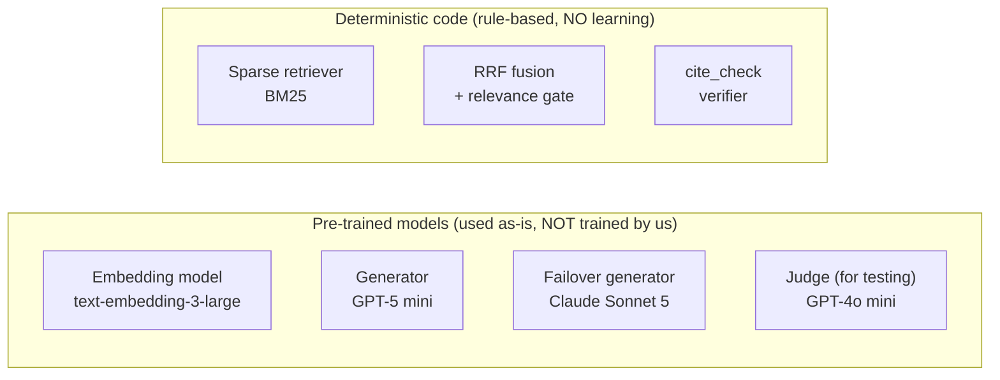
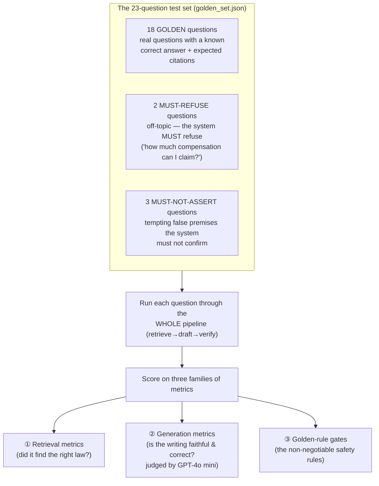
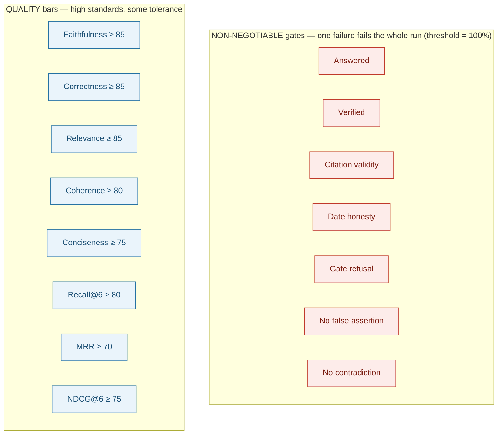
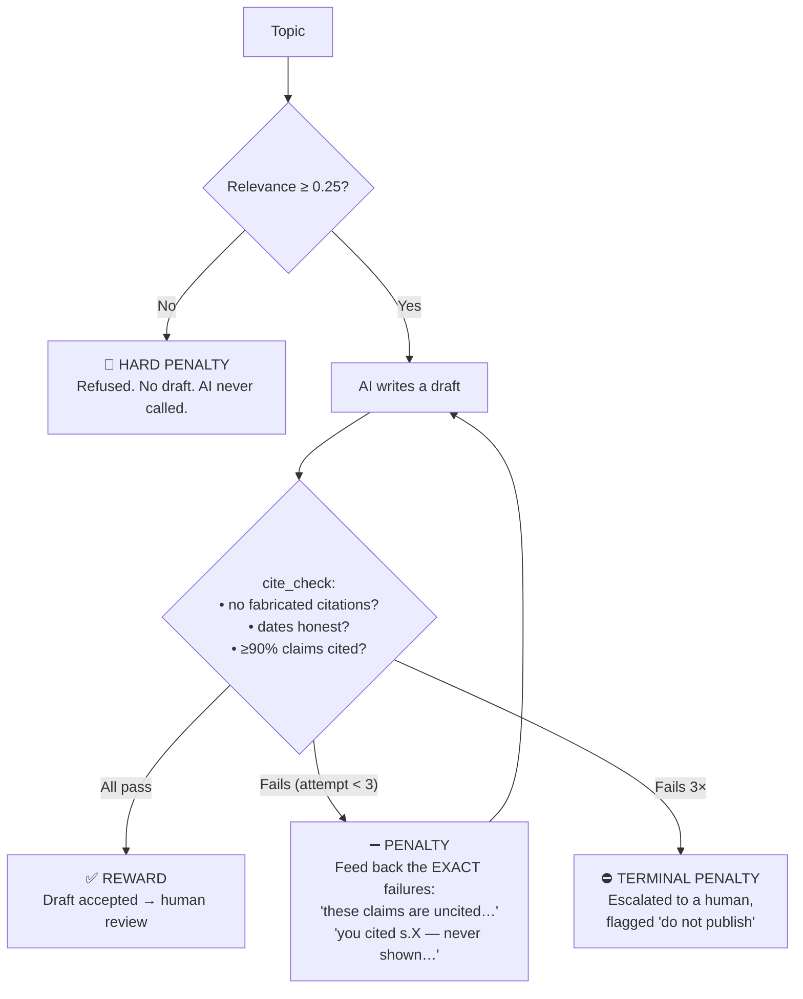
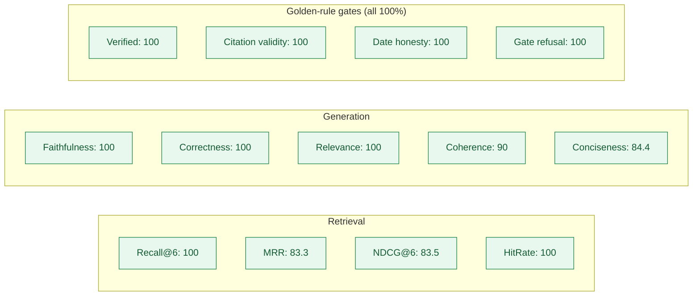

# DPDP Content Farm — Models, Evaluation & the Reward/Penalty Framework

**What this document answers:** which models the system uses and why, how it is tested and what the tests found, the exact parameters, and what plays the role of "reward" and "penalty" in keeping it accurate.

---

## 0. Read this first — an important clarification

This system is a **RAG** system (Retrieval-Augmented Generation). To describe it accurately, three common assumptions need correcting up front — not to be pedantic, but because the honesty of this whole project depends on describing it exactly as it is:

| Common assumption | The reality here |
|---|---|
| "It uses a **regression model**." | **No.** A regression model predicts a *number* from inputs. This system *retrieves* the relevant law and *generates cited text* from it. There is no regression anywhere in it. |
| "The RAG model was **trained** with rewards and penalties." | **No.** Nothing here is trained or fine-tuned. The AI models are used **exactly as the vendors ship them** (pre-trained, "off the shelf"). No weights are updated, ever. There is no reinforcement learning, no gradient training, no reward *model*. |
| "There must be **negative marks used to train** it." | Not in the training sense — but there **are** reward/penalty *mechanisms*, and they are central. They operate at **inference time** (each time content is generated) and at **quality-gate time** (each time the code changes), **not** during any training. §5 explains them in full. |

**So what actually makes it accurate, if not training?** Three things, in order of importance:
1. **Grounding** — the AI may only use the 81 pieces of official law that were retrieved; it cannot draw on its own memory.
2. **Verification** — a deterministic, rule-based checker (`cite_check`) inspects every citation and rejects the draft if anything is unsupported.
3. **Evaluation** — a test suite scores the whole system against a fixed set of questions and blocks any change that lowers quality.

Accuracy here comes from **auditable retrieval + verification**, not from a cleverly-trained model. That is a deliberate design choice, explained in §2.

---

## 1. The "models" actually used

The system is a pipeline of components. Some are **learned models** (pre-trained by vendors, used as-is); others are **deterministic code** we wrote (no learning at all).

| Component | What it is | Learned or rule-based? | Role |
|---|---|---|---|
| **text-embedding-3-large** (OpenAI) | Turns text into a 3,072-number "meaning fingerprint" | Pre-trained (used as-is) | Powers meaning-based search over the law |
| **BM25 / FastEmbed sparse** | Classic keyword/term-frequency scoring | Rule-based (statistical, not neural) | Finds exact terms like "Section 8(7)", "Rule 7" |
| **RRF fusion** (Reciprocal Rank Fusion) | Merges the two search result lists by rank | Deterministic formula | Combines meaning + exact-term search |
| **GPT-5 mini** (OpenAI) | Large language model | Pre-trained (used as-is) | Writes the draft (primary) |
| **Claude Sonnet 5** (Anthropic) | Large language model | Pre-trained (used as-is) | Writes the draft (automatic backup) |
| **cite_check** (our code) | Rule-based citation/claim verifier | Deterministic (no AI) | Catches fabrication, date errors, uncited claims |
| **GPT-4o mini** (OpenAI) | Large language model | Pre-trained (used as-is) | The "judge" that *scores* outputs during testing only |

**Key point:** the only components that "make decisions from data" are pre-trained and unchanged by us. The safety-critical parts — retrieval fusion, the relevance gate, and `cite_check` — are **plain deterministic code**, precisely so they can be audited line-by-line and cannot themselves hallucinate.

---

## 2. Why these choices — and why NOT a regression model or fine-tuning

### Why not a regression model
Regression answers "given these inputs, predict this number." The task here is "given a topic, produce marketing text where every legal claim is quoted from the official law." That is a *retrieval + text-generation + verification* problem. Regression is simply the wrong tool — there is no number to predict.

### Why not train / fine-tune our own model
This was a deliberate decision, and it is the single most important one in the project:

| Reason | Explanation |
|---|---|
| **Auditability** | A citation must be traceable to a specific page of the official PDF. Retrieval gives that; a fine-tuned model's "knowledge" lives in opaque weights that no reviewer can audit. |
| **A trained model still hallucinates** | Fine-tuning reduces but never eliminates made-up facts. For legal content, "usually right" is a liability. Grounding + verification gives a *hard* guarantee the model's memory cannot. |
| **The corpus is tiny and exact** | The law is 81 short pieces. Exact retrieval over 81 items is trivial and perfectly precise — training a model to memorise them would only *lose* provenance. |
| **Cloud-first constraint** | The system runs on free hosting with no capacity for training infrastructure or local model weights. |
| **The law changes** | When the Rules are amended, we re-load two PDFs (minutes). A fine-tuned model would need re-training and re-validation (weeks) — and could silently mix old and new law. |

> **The design principle:** *put correctness in auditable retrieval and deterministic verification, not in a model's learned weights.* Everything in §5 follows from this.

### Why these specific model choices

| Choice | Why |
|---|---|
| **OpenAI embeddings** (not a local model) | Hosted (no local dependency), 1,536 dims, strong quality/cost. Anthropic has no embeddings API. |
| **Hybrid dense + sparse retrieval** | Pure meaning-search misses literal section numbers; pure keyword-search misses paraphrases. Together they catch both. |
| **GPT-5 mini as primary writer** | Chosen after testing: the earlier gpt-4o-mini failed the legal guardrails (see §6); GPT-5 mini passes them at low cost. |
| **Claude Sonnet 5 as failover** | If OpenAI is rate-limited or down, generation continues automatically with the identical instructions. An always-online system must survive one provider's outage. |
| **GPT-4o mini as the test judge** | Cheap, consistent scoring for the evaluation suite. It only *grades*; it never writes published content. |

---

## 3. The testing framework — the "exam" the system sits

The system is graded against a **fixed set of 23 questions** with known-correct answers, defined in `eval/golden_set.json`.

### The three families of metrics

**① Retrieval metrics** — did search find the right provisions?
| Metric | Plain meaning |
|---|---|
| **Recall@6** | Of the provisions that *should* be found, what % were in the top 6? |
| **MRR** (Mean Reciprocal Rank) | How high up was the first correct provision? |
| **NDCG@6** | Are the correct provisions ranked near the top? |
| **HitRate** | Did at least one correct provision appear? |
| **R-Precision** | *(reported but not graded — see note)* |

**② Generation metrics** — judged by an independent AI (GPT-4o mini), each 0–100:
| Metric | Plain meaning |
|---|---|
| **Faithfulness** | Does the draft stay within the law it was shown (no invented claims)? |
| **Correctness** | Does it actually say the *right* thing (vs. the expert answer)? |
| **Relevance** | Does it answer the question asked? |
| **Coherence** | Is it well-structured and readable? |
| **Conciseness** | Is it free of padding? |
| **No-contradiction** | Does it avoid asserting the *opposite* of the correct answer? |

**③ Golden-rule gates** — the non-negotiable safety rules (each a pass/fail):
| Gate | Plain meaning |
|---|---|
| **Answered** | A real question must get an answer (not a needless refusal). |
| **Verified** | The draft passed `cite_check` (not escalated as unverifiable). |
| **Citation validity** | Every citation points to a provision that was actually retrieved. |
| **Date honesty** | A not-yet-in-force law is never presented as active today. |
| **Gate refusal** | Off-topic questions are refused *before* the AI is ever called. |
| **No false assertion** | A false premise is never confirmed. |

> **Why faithfulness and correctness are judged separately:** a draft can be perfectly *faithful* to the wrong provision (scoring 100 on faithfulness) while being *incorrect*. The two are graded by separate judge calls that never see each other's evidence, so one cannot mask the other.

---

## 4. The exact parameters

Every tunable value in the system, and what it does:

| Parameter | Value | What it controls |
|---|---|---|
| **Embedding dimensions** | 1,536 | Size of each "meaning fingerprint" |
| **Distance metric** | Cosine | How meaning-similarity is measured |
| **TOP_K** | **6** | How many provisions are retrieved per topic |
| **MIN_RELEVANCE** | **0.25** | Minimum cosine relevance to proceed; below it → "no grounded source" (the grounding gate) |
| **MIN_TRACEABILITY** | **0.90** | At least 90% of legal claims must carry a valid citation to pass `cite_check` |
| **MAX_ATTEMPTS** | **3** | First draft + up to 2 redraft retries before escalating to a human |
| **Generation temperature** | **0.0** | Lowest randomness — the system favours determinism for legal text |
| **Max tokens** | 8,192 | Upper bound on draft length (includes the model's internal reasoning) |
| **Judge model** | GPT-4o mini | Scores the generation metrics during testing |
| **Retrieval fusion** | RRF | How dense + sparse results are merged |

### The grading thresholds (the "pass mark" for each metric)

These live in `eval/run_eval.py` as the `GATES`. There are **two tiers**:

| Gate | Threshold | Tier |
|---|---|---|
| Answered, Verified, Citation validity, Date honesty, Gate refusal, No-false-assertion, No-contradiction | **100%** | Non-negotiable — a single failure fails the run |
| Faithfulness | 85 | Quality bar |
| Correctness | 85 | Quality bar |
| Relevance | 85 | Quality bar |
| Coherence | 80 | Quality bar |
| Conciseness | 75 | Quality bar |
| Recall@6 | 80 | Quality bar |
| MRR | 70 | Quality bar |
| NDCG@6 | 75 | Quality bar |
| R-Precision | *(reported, not graded)* | With 1–2 relevant items in a top-6, its ceiling is set by arithmetic, not quality, and all 6 reach the prompt regardless of order — so grading it would measure the metric, not the system. |

---

## 5. The reward / penalty framework (the honest answer)

There is **no training reward**. But there are two real reward/penalty mechanisms, and they are what keep the system honest. Here is the exact mapping from the reinforcement-learning vocabulary to what actually exists:

| RL concept | What plays that role here | When |
|---|---|---|
| **Reward** | A draft is **accepted** — every citation checks out, dates are honest, ≥90% of claims are cited | Each generation |
| **Penalty** | A draft is **rejected** and the *specific* errors are fed back for correction | Each generation |
| **Terminal penalty** | After 3 failed attempts, the draft is **escalated to a human** — it may never auto-pass | Each generation |
| **Hard penalty (no output)** | Off-topic → **refused before the AI is even called** | Each generation |
| **"Negative marks"** | A quality **gate fails** → the code change is **blocked** in CI | Each code change |
| **Training** | *(none — no weights are ever updated)* | — |

### Level A — Inference-time self-correction (the closest thing to reward/penalty)

Every single time content is generated, this loop runs. It is control flow, **not** learning — but it behaves like reward/penalty:

- **The reward** is passing all three checks → the draft is accepted for human review.
- **The penalty** is rejection *with a precise reason*. The model is handed its own draft plus the exact list of failing sentences and told to fix only those. (Blindly rewriting from scratch was measured to introduce *new* errors, so the correction is surgical.)
- **The terminal penalty** — 3 strikes — means the draft is never silently passed; it is escalated to a human with the reasons shown. A polished-looking draft that fails verification is treated as the most dangerous output, not the least.
- **The hard penalty** is the relevance gate: an off-topic request earns *no output at all* — the AI is never even invoked.

**What is NOT happening:** none of this updates any model. The model does not "learn" from the penalty across requests. Each request starts fresh; the loop simply refuses to accept an unverified draft *within* that request.

### Level B — Evaluation-time gates (the "marking scheme")

When the system's code changes, the 23-question exam runs in CI. Here the reward/penalty is at the *system* level:

- **Reward:** all gates pass → the change is allowed.
- **Negative mark:** any non-negotiable gate below 100%, or any quality bar missed → the run is marked **FAILED** and the change is flagged as a regression.

This is what stopped a bad change during development: when the primary writer was switched to a weaker model, the eval's `verified` and `citation_validity` gates went red and surfaced the regression before it could ship (see §6).

---

## 6. Complete test findings

### Finding 1 — the weaker model failed the guardrails (why GPT-5 mini was chosen)
An earlier candidate primary writer (**gpt-4o-mini**) was tested and **failed** the non-negotiable gates: it fabricated sub-section citations it was never shown, and dropped the "not yet in force" dating. It was rejected. The next candidate, **GPT-5 mini**, passed — this is the evaluation framework doing its job.

### Finding 2 — a precision improvement, verified safe
GPT-5 mini cites at fine granularity (e.g. `s.8(5)`, the exact sub-section) rather than the whole section. Initially `cite_check` flagged these as fabrications. On inspection they were **more precise, genuinely-supported** citations, so `cite_check` was upgraded to **accept a sub-section when its parent section was retrieved and the sub-section marker genuinely appears in that text** — while still rejecting invented ones (e.g. a made-up `s.8(15)`). Verified with an 8-case truth table.

### Finding 3 — a hidden inconsistency caught and fixed
After the above change, the exam showed `verified` at 100% but `citation_validity` at 94.4% on the *same* drafts — a contradiction. Root cause: the test harness kept its **own** older copy of the fabrication rule. It was corrected to use the one shared rule, removing the inconsistency. (This is exactly the kind of "two copies of a rule that drift apart" bug the project guards against.)

### The measured scores (GPT-5 mini, after all fixes)

| Family | Metric | Score | Threshold | Result |
|---|---|---|---|---|
| Retrieval | Recall@6 | **100** | 80 | ✅ |
| Retrieval | MRR | **83.3** | 70 | ✅ |
| Retrieval | NDCG@6 | **83.5** | 75 | ✅ |
| Retrieval | HitRate | **100** | — | ✅ |
| Generation | Faithfulness | **100** | 85 | ✅ |
| Generation | Correctness | **100** | 85 | ✅ |
| Generation | Relevance | **100** | 85 | ✅ |
| Generation | Coherence | **90** | 80 | ✅ |
| Generation | Conciseness | **84.4** | 75 | ✅ |
| Golden rule | Answered | **100** | 100 | ✅ |
| Golden rule | Verified | **100** | 100 | ✅ |
| Golden rule | Citation validity | **100** | 100 | ✅ |
| Golden rule | Date honesty | **100** | 100 | ✅ |
| Golden rule | Gate refusal | **100** | 100 | ✅ |
| Golden rule | No contradiction | **100** | 100 | ✅ |
| Golden rule | No false assertion | **100** | 100 | ✅ |

### Speed (measured, warm)
| Stage | Median (P50) | Slowest (P95) |
|---|---|---|
| Retrieval | ~3.4 seconds | ~4.7 seconds |
| Generation (incl. any redrafts) | ~69 seconds | ~154 seconds |

> Generation is slower when a draft needs a redraft or two — the price of never shipping an unverified claim.

---

## 7. How the tests are run

- **On demand / locally:** `python -m eval.run_eval` runs the full 23-question exam. `python -m eval.run_eval --retrieval-only` runs just the (free) retrieval half.
- **Automatically (CI):** on every code change, the free retrieval gate runs; weekly (or on demand) the full exam runs. A failing gate blocks the change. This is the "negative marks" mechanism at the system level.
- **Result artifact:** every run writes per-question detail to `eval/last_run.json` for inspection.

---

## 8. One-paragraph summary

This is **not** a trained, regression, or reinforcement-learning model — nothing here updates model weights. It is a retrieval-and-verification system built on **pre-trained, off-the-shelf** models (OpenAI embeddings, GPT-5 mini, Claude Sonnet 5), whose accuracy comes from **auditable grounding** and a **deterministic verifier**, not from learned memory. What functions as "reward and penalty" is (a) an inference-time loop that **accepts** a draft only if every citation is verified and **rejects-and-corrects** it otherwise, escalating to a human after three failures, and (b) an evaluation suite of 23 questions with pass/fail gates that **blocks** any code change lowering quality. Measured against that suite, the current system scores **100% on faithfulness, correctness, and every non-negotiable safety gate.**

---

*Every number in this document is measured, not estimated. The safety gates it describes are enforced in code (`src/graph/cite_check.py`, `eval/run_eval.py`), not by convention. Where the reinforcement-learning vocabulary was used, it was mapped to the real mechanism that plays that role — no training process is implied or claimed.*
