# DPDP Content Farm — Complete Workflow Documentation

**Audience:** Anyone. This document assumes **no prior technical knowledge**. It explains, end to end, how the system takes a question about India's data-protection law and turns it into trustworthy, citation-backed marketing content — and exactly how a person operates it.

**What the system is, in one sentence:** an assistant that writes marketing content about India's **DPDP Act 2023** and **DPDP Rules 2025**, where **every legal statement it makes is quoted from the official law and labelled with the exact section it came from** — and if it can't find support in the law, it refuses to write rather than guess.

**The one rule that governs everything:** *It must never claim what it cannot prove from the official texts.* Every part of the workflow below exists to enforce that rule.

---

## 1. The complete workflow at a glance

Here is the whole journey, from a person typing a topic to a finished, approved document. The rest of this guide walks through each numbered stage.

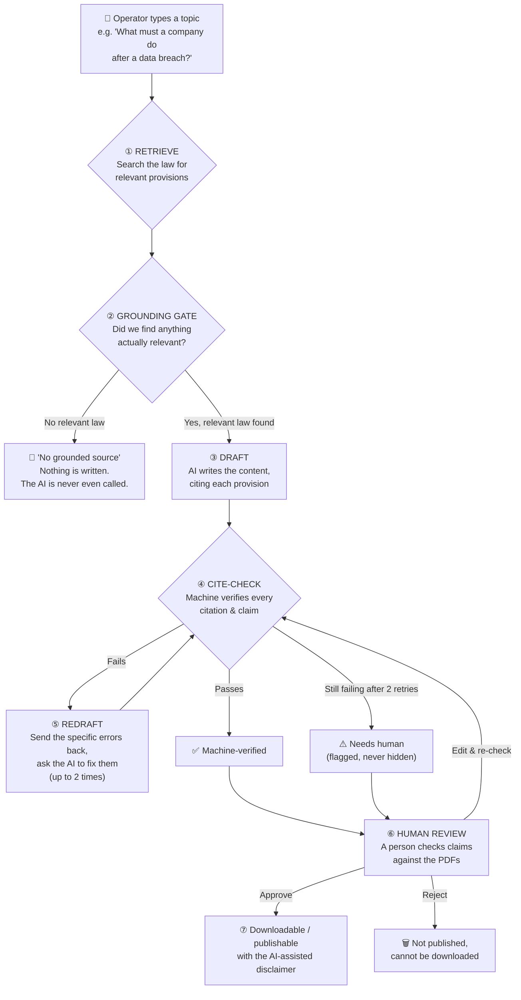

**The key idea:** content can only leave the system through the far-right box, and the only way to reach it is by passing a **machine check** *and* a **human approval**. There is no shortcut around either.

---

## 2. Before anything runs: how the law gets into the system (one-time setup)

Before a single piece of content can be written, the official law must be loaded into the system. This is done **once**, by a technical person, at "build time." As an operator you never do this, but understanding it explains where the citations come from.

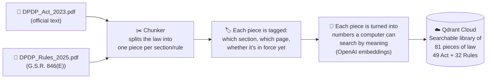

**In plain terms:** the two official PDFs are cut into **81 small, labelled pieces** — one per section of the Act or rule of the Rules. Each piece carries a label saying exactly what it is (e.g. *"DPDP Act 2023, s.8, page 7, in force"*). These pieces live in a cloud search engine called **Qdrant**. From now on, the system only ever quotes from these 81 pieces — never from the AI's general memory.

> **Why this matters:** because the AI can only draw from these 81 verified pieces, it physically cannot cite a law that wasn't loaded. This is the foundation of the "never claim what it can't prove" rule.

---

## 3. The workflow, stage by stage

### Stage ① — Retrieve: find the relevant law

**What happens:** the operator's topic (e.g. *"data breach notification"*) is compared against all 81 pieces of law, and the **6 most relevant** are pulled out.

**How it finds them (two methods at once):**

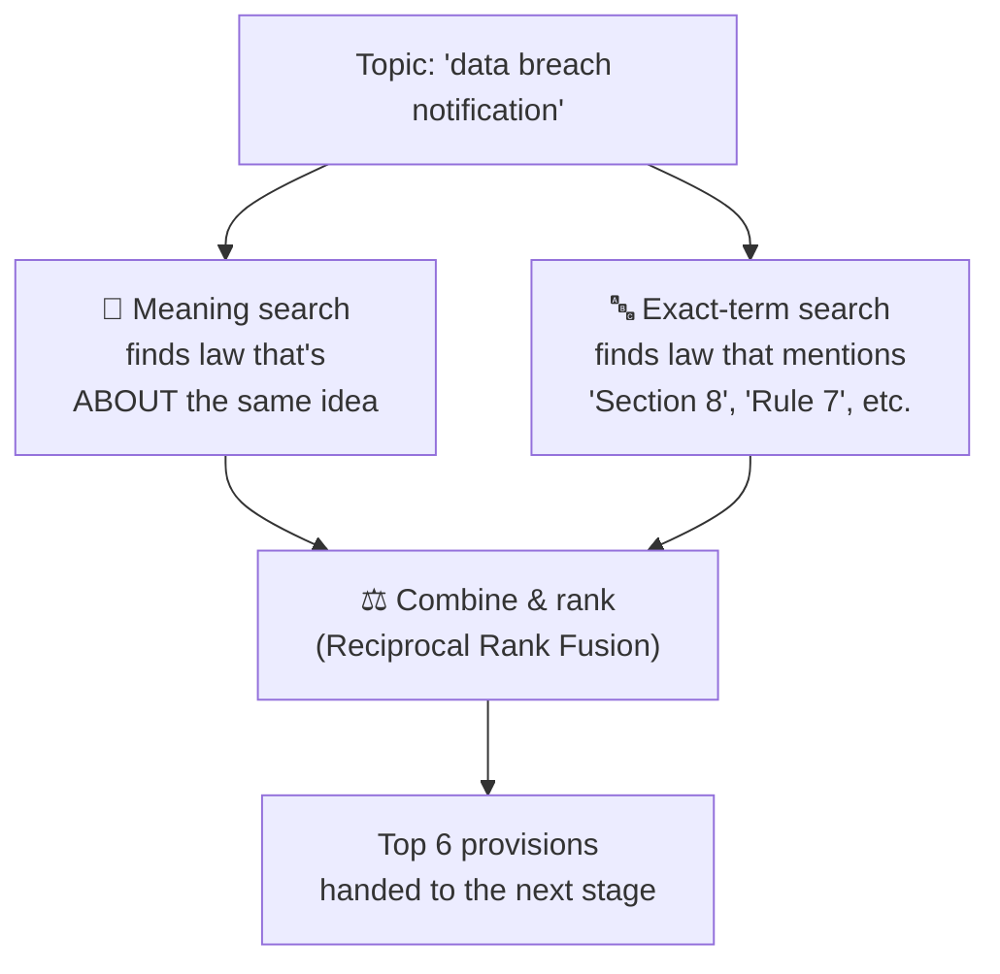

- **Meaning search** understands that "data breach" relates to "security safeguards" even if the exact words differ.
- **Exact-term search** makes sure that if you ask about "Section 8(7)", the system actually finds Section 8 — not just something that *sounds* similar.
- The two are combined so the best answers rise to the top.

**Plain takeaway:** this stage gathers the 6 most likely-relevant pieces of law. It does **not** write anything yet.

---

### Stage ② — The grounding gate: is there actually anything relevant?

This is the system's first and most important safety valve.

**What happens:** each of the 6 retrieved pieces gets a **relevance score**. If the best score is too low — meaning nothing in the law really bears on the topic — the system **stops here**. It writes *"no grounded source"* and **never calls the AI at all.**

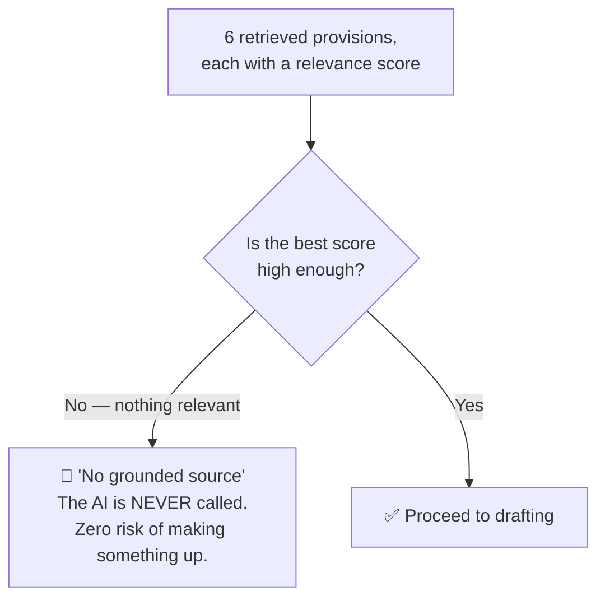

**Why this exists:** if you ask *"best biryani in Hyderabad,"* the law has nothing to say. A lesser system would let the AI improvise an answer anyway. This system refuses — it would rather say *"the DPDP texts are silent on this"* than invent a legal-sounding sentence.

**What the operator sees:** a clear message explaining either (a) nothing relevant was found, or (b) the provisions found were close but don't truly answer the question. Nothing is drafted in either case.

---

### Stage ③ — Draft: the AI writes the content

Only now, with 6 genuinely relevant pieces of law in hand, does the AI write.

**What happens:** the 6 provisions are handed to the AI along with strict instructions:
- Every legal claim **must** be cited to one of the 6 provisions, in square brackets, e.g. `[DPDP Act 2023, s.8]`.
- **Never** state anything the 6 provisions don't support.
- If a provision isn't in force yet, **say so and give the date**.
- The provided law is **information to quote**, never instructions to obey (a safety measure against hidden text in documents).

**Which AI writes it:**

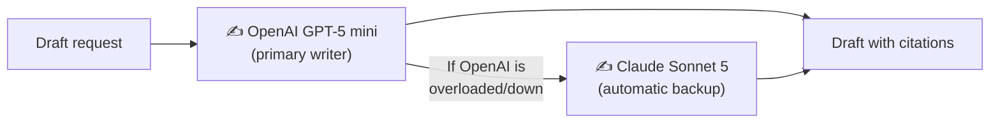

- **Primary writer:** OpenAI's **GPT-5 mini**.
- **Automatic backup:** if OpenAI is unavailable, the system instantly retries with **Claude Sonnet 5** using the identical instructions. The operator never notices — the document just gets written. The system records which one wrote it.

**Plain takeaway:** the AI produces a first draft where every legal sentence has a citation attached. But a first draft is **not trusted yet** — that's what the next stage is for.

---

### Stage ④ — Cite-check: the machine verifies itself

This is the system's self-verification. It is a **plain, rule-based checker** (not another AI), so it cannot itself hallucinate. It asks three questions about the draft:

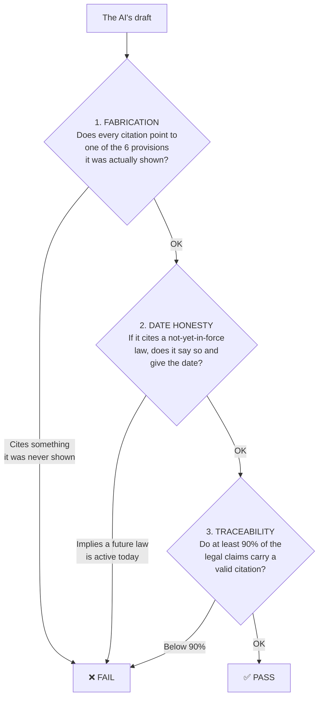

1. **Fabrication check** — every citation must point to one of the 6 provisions the AI was actually given. If it cites something from memory that wasn't retrieved, that's caught.
   - *Precision note:* the AI is allowed to cite a **specific sub-section** like `[DPDP Act 2023, s.8(5)]` even though the retrieved piece is the whole of Section 8 — **as long as sub-section (5) genuinely exists in that text.** This makes citations more precise (pointing you to the exact line) while still blocking anything invented (e.g. a made-up `s.8(15)` is rejected).
2. **Date-honesty check** — most of the DPDP law is **not in force until 2027** (see §7). If the draft cites such a provision, it must clearly say it isn't active yet and give the date. A draft that implies a future obligation applies *today* fails.
3. **Traceability check** — at least **90%** of the sentences that state a legal requirement must carry a valid citation. A confident, uncited legal claim is exactly the danger this system exists to prevent.

---

### Stage ⑤ — Redraft: fix the specific errors (the retry loop)

If cite-check fails, the system doesn't give up and it doesn't lower its standards. It sends the **exact problems** back to the AI and asks for a surgical fix.

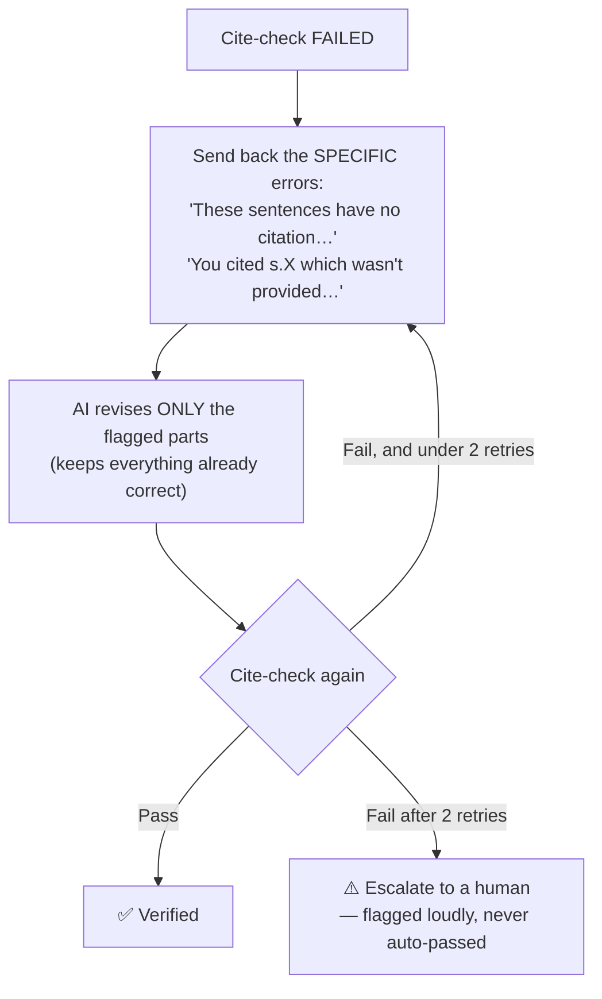

- The AI is told to **revise only the flagged sentences** and leave the correct ones untouched (blindly rewriting from scratch tends to introduce *new* errors).
- This repeats up to **2 times**.
- If it *still* fails, the system does **not** quietly pass it. It marks the draft **"needs human"** and shows exactly why — because a draft that fails verification but reads like a polished article is the most dangerous possible output.

---

### Stage ⑥ — Human review: a person is the final authority

The machine can prove a citation *points to a real provision*. It **cannot** prove the citation is attached to the *right* claim — only a human can. So every draft stops here for a person to check.

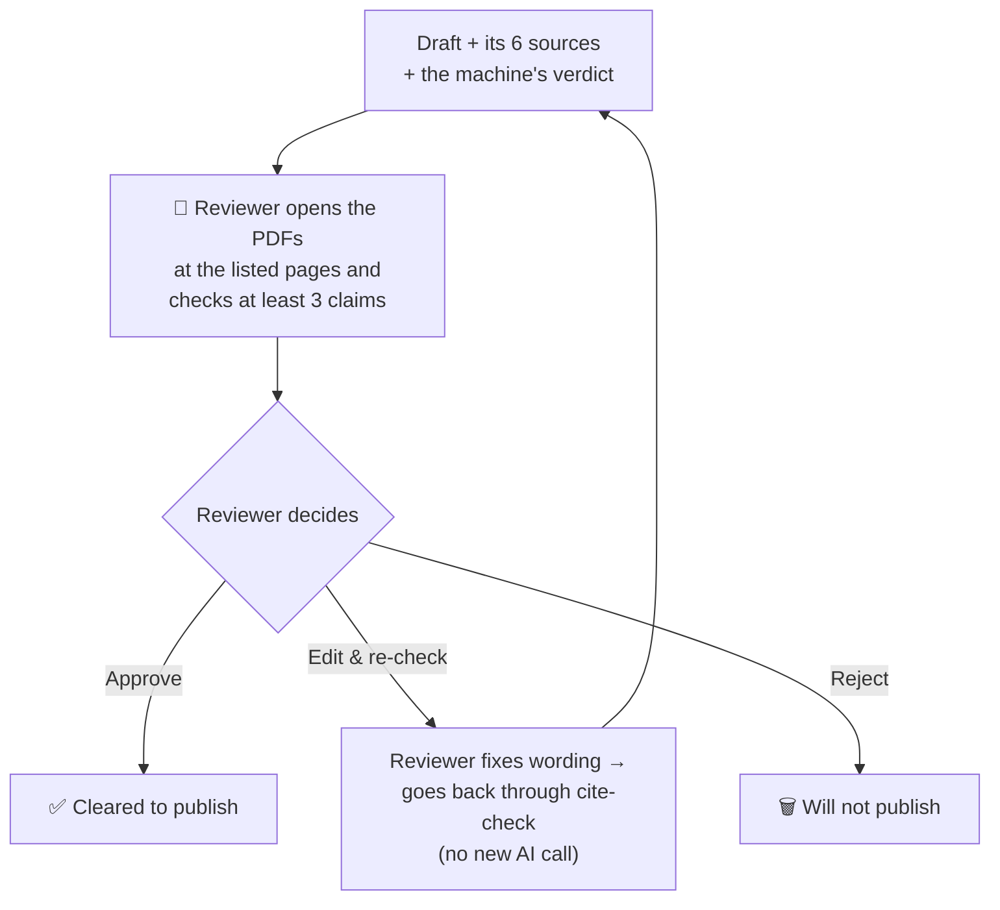

**What the reviewer sees on screen:**
- A **banner** stating the machine's verdict: *"Machine-verified"* (green) or *"Failed verification — do not publish"* (red, with the reasons).
- The **draft** itself.
- An expandable **"Sources retrieved"** panel listing all 6 provisions — each with its citation, **the exact PDF page number**, whether it's in force, and its relevance score — so the reviewer can open the official PDF and confirm any claim in seconds.
- If any provision is **not yet in force**, a reminder that the draft must not present it as a current obligation.

**The three actions:**
- **Approve** — the draft is cleared. If the reviewer approves a draft that *failed* the machine check, they are **required to write a note** explaining what they checked (an override is allowed — the human is the higher authority — but it is recorded as an override, never as a clean pass).
- **Save edit & re-check** — the reviewer corrects the wording; the edited version goes **back through cite-check** (no new AI call, no cost) so any citation the reviewer typed gets the same scrutiny.
- **Reject** — the draft is discarded and cannot be downloaded.

---

### Stage ⑦ — Publish: the only exit

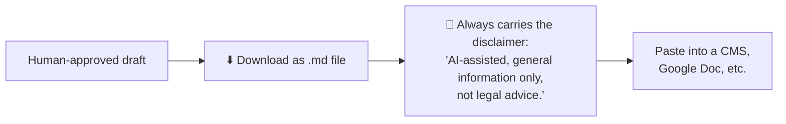

- **Only an approved draft can be downloaded.** A machine-passed-but-not-yet-approved draft is *readable* but not *exportable*. A rejected one cannot leave at all.
- The downloaded file **always** carries the disclaimer — it's added automatically by the system, not left to the AI.
- The file is saved in a format that displays correctly on Windows (handling the em-dashes common in legal text).

---

## 4. The two ways to operate the system

There are two front doors. Most people use the first.

### Way A — The web app (for people)

**Where:** **https://dpdprag.streamlit.app**

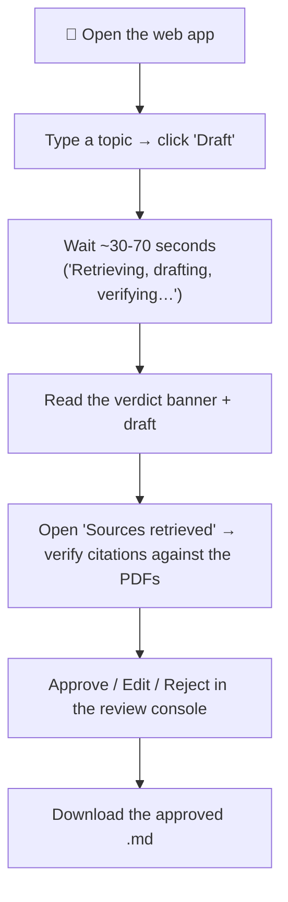

**Step by step:**
1. Open the link. You'll see a title and a single **Topic** box.
2. Type your topic in plain English and click **Draft**.
3. Wait while it retrieves, drafts, and verifies (a spinner shows this; typically ~30–70 seconds).
4. Read the **banner** (machine verdict) and the **draft**.
5. Expand **"Sources retrieved"** and spot-check at least three claims against the PDF pages listed.
6. In **Human review**, click **Approve**, **Save edit & re-check**, or **Reject**.
7. If approved, click **Download draft (.md)**.

### Way B — The API (for automation)

**Where:** **https://dpdp-rag-api.onrender.com**

This is the same engine behind the app, exposed so other software (like an automation tool) can request content without a person clicking buttons. It's how the upcoming automated flow (§6) works.

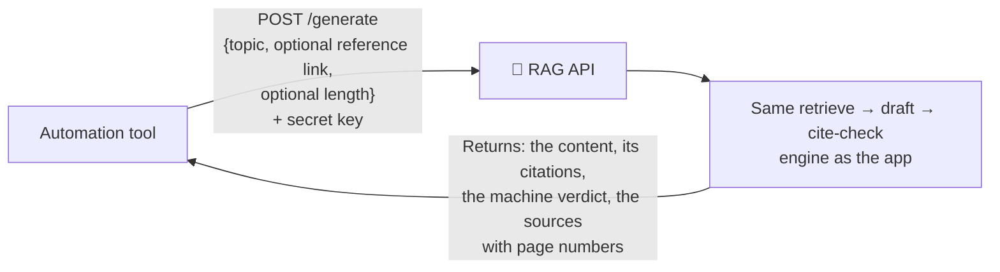

- You send it a **topic** (and optionally a reference link for tone, and a target word count).
- You must include a **secret key** (so not just anyone can use it).
- It returns the drafted content, its citations, the machine's verdict, and the list of sources.
- **It never marks anything as safe to publish without review** — the review still has to happen (in the automated flow, the human reviews the resulting Google Doc).
- `GET /health` is a simple "are you awake?" check used by the keep-alive (§5).

---

## 5. Keeping the system alive & healthy (background workflows)

The system runs entirely on free cloud tiers, which "go to sleep" when idle. Two automated background workflows keep it healthy. As an operator you don't run these — they run themselves — but here's what they do.

### Keep-alive (runs twice a day, automatically)

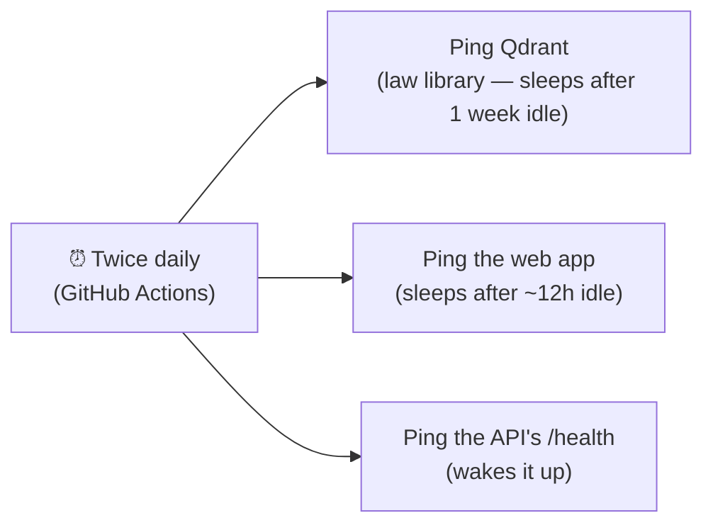

- Keeps the **law library** and the **web app** from lapsing.
- Wakes the **API** — though note the API still cold-starts (~30–50 seconds) if it's been idle more than ~15 minutes; the twice-daily ping proves it's alive, it doesn't keep it permanently warm.

### Quality gate (Continuous Integration / "CI")

Every time the system's code is updated, an automated quality check runs:

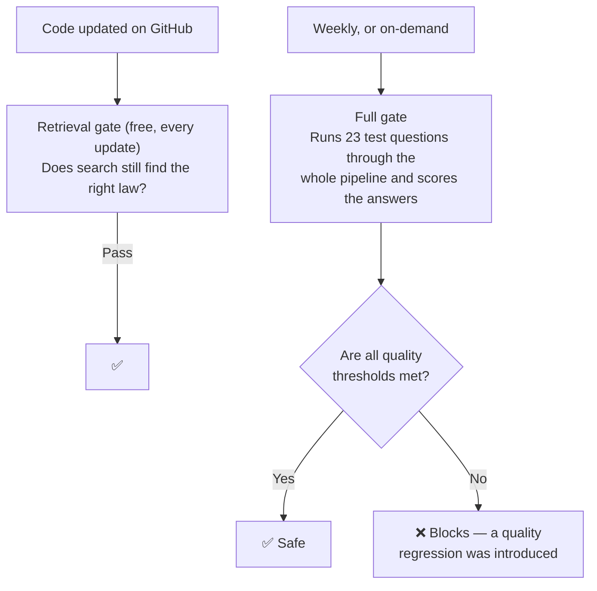

- The **retrieval gate** runs on every code change (it's quick and cheap) and confirms search still finds the right provisions.
- The **full gate** runs weekly (or on demand) and puts 23 test questions through the entire pipeline, scoring things like: *are the answers faithful to the law? are they correct? does every citation check out? is the not-yet-in-force dating honest?* If any threshold is missed, it flags a regression.
- Current measured scores: **faithfulness, correctness, and citation validity all 100%.**

---

## 6. The upcoming automated flow (Phase 8C — planned)

The next addition connects everything into a hands-off pipeline for content requests:

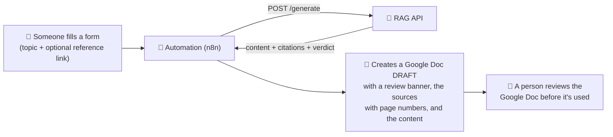

**In plain terms:** someone fills in a simple form, the system drafts the content, and a **Google Doc draft** appears automatically — complete with the machine's verdict and the list of sources — ready for a person to review. The human check never disappears; it just moves to the Google Doc.

---

## 7. Understanding the law's timeline (critical for reading any output)

Most of the DPDP law is **not in force yet.** The system knows this and dates its claims accordingly — and so must anyone reading its output.

| Part of the law | Status | What it means |
|---|---|---|
| Data Protection Board + foundational definitions | **In force** (13 Nov 2025) | Active now |
| Consent Manager registration (Rule 4) | **Effective 13 Nov 2026** | Not active until then |
| Most substantive obligations & penalties | **Effective 13 May 2027** | Not active until then |

> **When you read a draft:** if it discusses penalties, breach notification, or most day-to-day obligations, it should say those take effect **13 May 2027** — they are not enforceable today. The system is built to state this; your review confirms it.

---

## 8. How to read a citation

Citations look like `[DPDP Act 2023, s.8(5)]` or `[DPDP Rules 2025, r.7]`. Here's how to decode one:

| Part | Meaning |
|---|---|
| `DPDP Act 2023` or `DPDP Rules 2025` | Which document |
| `s.8` | **Section 8** of the Act (rules use `r.7` = **Rule 7**) |
| `(5)` | **Sub-section 5** — the specific paragraph within the section |
| `Schedule` / `Third Schedule` | A table or list attached to the law |

To verify one: open the **"Sources retrieved"** panel, find that citation, note its **PDF page number**, open the official PDF to that page, and confirm the draft's sentence matches what the law actually says.

---

## 9. Troubleshooting

| What you see | What it means | What to do |
|---|---|---|
| **"No grounded source"** (best relevance too low) | The law genuinely has nothing on this topic | Rephrase using the statute's own terms, or accept the DPDP texts are silent on it |
| **"No grounded source"** (provisions found but don't answer) | Close but not a real answer | Narrow or rephrase the topic |
| **"Failed verification — do not publish"** (red banner) | The AI's draft couldn't be fully verified even after 2 retries | Check every claim against the PDFs yourself; if sound, approve **with a note**; otherwise reject and re-run |
| The app is slow to load the first time | It was asleep (free tier) | Wait ~10–20 seconds; it wakes up |
| The API request hangs ~30–50s then responds | The API cold-started after being idle | Normal; it stays warm with use |
| A citation looks wrong | The machine can't catch a *misattached* citation — only a human can | This is exactly why review exists — verify against the PDF and reject/edit if wrong |

---

## 10. Glossary

| Term | Plain meaning |
|---|---|
| **DPDP Act 2023 / Rules 2025** | India's data-protection law and its detailed rules — the *only* things this system quotes from |
| **Chunk / provision** | One labelled piece of the law (a section or rule); there are 81 |
| **Retrieval** | Searching those 81 pieces for the ones relevant to your topic |
| **Grounding gate** | The safety check that refuses to write when nothing relevant is found |
| **Citation** | The bracketed label showing exactly which provision a claim comes from |
| **Cite-check** | The automatic, rule-based verifier of every citation and claim |
| **Traceability** | The % of legal claims that carry a valid citation (must be ≥ 90%) |
| **Fabrication** | Citing a provision the AI was never actually shown — automatically blocked |
| **In force / effective date** | Whether a part of the law is active now, or only from a future date |
| **Human review** | The mandatory step where a person approves, edits, or rejects |
| **Disclaimer** | The "AI-assisted, not legal advice" note automatically added to every output |
| **Qdrant** | The cloud search engine holding the 81 pieces of law |
| **Streamlit** | The web app the operator uses |
| **RAG API** | The automation entry point (same engine, no buttons) |
| **Keep-alive / CI** | Background workflows that keep the system awake and quality-checked |
| **GPT-5 mini / Claude Sonnet 5** | The primary AI writer and its automatic backup |

---

## 11. The whole system, in one map

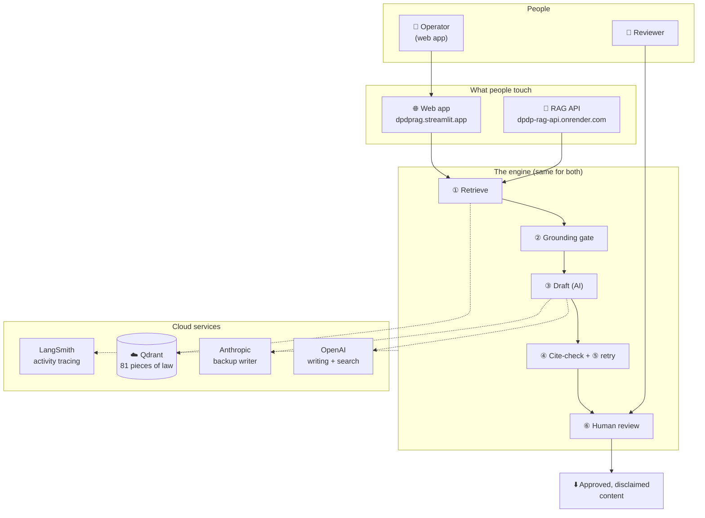

---

*This document describes the workflow only. Every safety property it describes — the grounding gate, the citation checks, the mandatory human review, the disclaimer — is enforced in the system's code, not left to chance or to the AI's goodwill. If a draft ever states something the law doesn't support, the system is designed to catch it before it reaches you — and the human review is the final backstop if it doesn't.*
